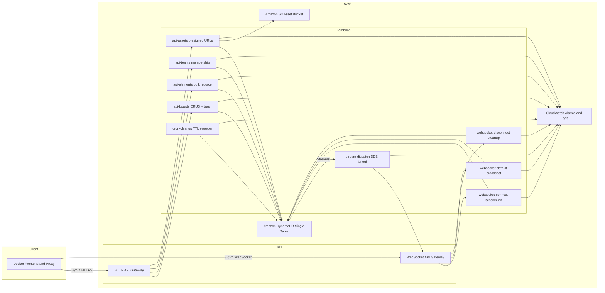
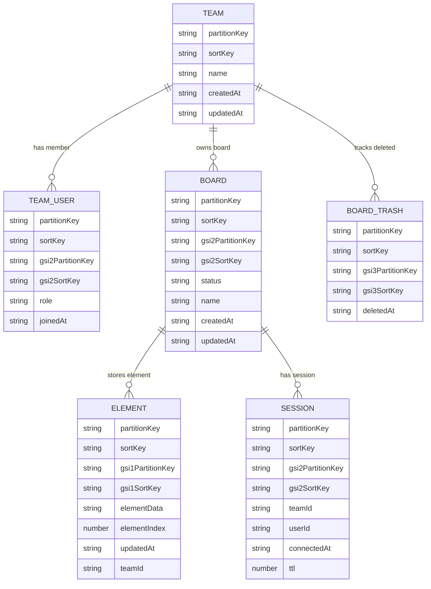

# AWS Hosted Excalidraw

This repository delivers a managed Excalidraw experience on AWS.

The backend is all designed to be deployed to AWS with iAM authentication and then the frontend is designed to run in a Docker container that connects to the backend using SigV4-signed requests. This allows teams to self-host Excalidraw with no public access (and no complex authentication system), relying on IAM instead.

> NOTE: This is in development still and may not be production ready. Use at your own risk!

## Architecture At A Glance



### Key Components

- **Frontend container (`apps/frontend`)** – React UI bundled with an Express proxy (`apps/frontend-server`) that signs REST and WebSocket traffic using the latest Smithy SigV4 libraries.
- **Serverless backend** – Multi-Lambda application deployed via AWS CDK:
  - `api-boards`, `api-elements`, `api-teams`, `api-assets` (HTTP handlers)
  - `websocket-connect`, `websocket-default`, `websocket-disconnect` (API Gateway WebSocket routes)
  - `stream-dispatch` (DynamoDB Streams fan-out)
  - `cron-cleanup` (scheduled maintenance)
- **Persistence** – DynamoDB single-table design with three GSIs, S3 asset bucket with hierarchical prefixes, CloudWatch dashboards/alarms.

## Running Excalidraw (User Guide)

### Prerequisites

1. **AWS credentials** with access to the deployed stack (DynamoDB, S3, API Gateway). Configure a local profile if you are not using the default profile.
   ```bash
   aws configure --profile team-excalidraw
   ```
2. **Docker** (Desktop or Engine) with networking access to AWS endpoints.
3. Backend deployment outputs (or SSM parameters) for:
   - REST API URL (e.g. `https://abc123.execute-api.eu-west-1.amazonaws.com/prod`)
   - WebSocket URL (e.g. `wss://abc123.execute-api.eu-west-1.amazonaws.com/prod`)
   - Asset bucket name (e.g. `excalidraw-assets-prod-123456789012`)

### Quick Start – Using the Pre-built Docker Image

Pull the latest Docker image from GitHub Container Registry:

```bash
docker pull ghcr.io/nicholasgriffintn/aws-hosted-excalidraw
```

Run the container with your AWS configuration:

```bash
docker run --rm \
  --name excalidraw \
  -p 3000:3000 \
  -e EXCALIDRAW_API_URL=https://abc123.execute-api.eu-west-1.amazonaws.com/prod \
  -e EXCALIDRAW_WS_URL=wss://abc123.execute-api.eu-west-1.amazonaws.com/prod \
  -e EXCALIDRAW_ASSET_BUCKET=excalidraw-assets-prod-123456789012 \
  -e AWS_REGION=eu-west-1 \
  -e AWS_PROFILE=team-excalidraw \
  -v ~/.aws:/home/node/.aws:ro \
  ghcr.io/nicholasgriffintn/aws-hosted-excalidraw
```

Navigate to <http://localhost:3000>. The proxy automatically presigns WebSocket upgrades and REST calls, so the UI works against IAM-protected API Gateway endpoints without additional setup.

---

## Local Development

### Prerequisites for Development

- Node.js 22+
- `pnpm` (Corepack enabled)
- Docker and Docker Compose
- AWS CLI v2 configured with deployment credentials

### Running Locally with Docker Compose

For local development, clone the repository and use docker-compose:

```bash
git clone https://github.com/nicholasgriffintn/aws-hosted-excalidraw.git
cd aws-hosted-excalidraw

# Edit docker-compose.yml or provide environment overrides when starting:
EXCALIDRAW_API_URL="https://abc123.execute-api.eu-west-1.amazonaws.com/prod" \
EXCALIDRAW_WS_URL="wss://abc123.execute-api.eu-west-1.amazonaws.com/prod" \
EXCALIDRAW_ASSET_BUCKET="excalidraw-assets-prod-123456789012" \
AWS_PROFILE="team-excalidraw" \
docker-compose up --build
```

The compose file mounts `~/.aws` into the container so the Express proxy can sign requests with SigV4 using the specified profile. The app will be available at <http://localhost:4002>.

### Development Workflow

For active development with hot-reloading:

```bash
# Use the development compose file
docker-compose -f docker-compose.dev.yml up
```

This provides a development environment with volume mounts for the source code, enabling hot-reloading of changes.

---

## Deploying The Backend (AWS CDK)

### Prerequisites for Backend Deployment

- Node.js 22+
- `pnpm` (Corepack enabled)
- AWS CLI v2 configured with deployment credentials
- AWS CDK CLI (`npm install -g aws-cdk@latest`)
- Repository cloned locally

### Install Dependencies

From the repository root:

```bash
pnpm install
pnpm --filter "@aws-hosted-excalidraw/frontend" build
pnpm --filter "@aws-hosted-excalidraw/frontend-server" build
```

Lambda handlers are built on demand by the CDK bundlers, so no manual compilation step is required for the `apps/api-*` packages.

### Bootstrap & Deploy

```bash
cd infra/cdk
pnpm install
pnpm run bootstrap aws://<ACCOUNT_ID>/<REGION>          # run once per environment
pnpm run synth                                         # optional: inspect CloudFormation
pnpm run deploy                                  # deploy stacks in dependency order
```

Key stacks:

- `ExcalidrawPersistence-*` – DynamoDB table + S3 bucket
- `ExcalidrawApi-*` – REST Lambda handlers & HTTP API Gateway
- `ExcalidrawRealtime-*` – WebSocket API + stream processors
- `ExcalidrawObservability-*` – CloudWatch dashboards/alarms
- `ExcalidrawFrontend-*` – SSM parameters & outputs consumed by the Docker frontend

### Useful Outputs

After deployment, note the following outputs (also mirrored in SSM Parameter Store):

- `ExcalidrawApiUrl-*`
- `ExcalidrawWebSocketUrl-*`
- `ExcalidrawAssetBucket-*`

Feed these values into the Docker environment variables described earlier.

---

## Repository Layout

```
.
├── Dockerfile                 # Builds frontend + SigV4 proxy container
├── docker-compose.yml         # Production-ish docker entrypoint
├── docker-compose.dev.yml     # Local developer compose
├── apps/
│   ├── frontend/              # React 19 + Excalidraw UI
│   ├── frontend-server/       # Express 5 SigV4 proxy (Node 22)
│   ├── api-boards/            # Lambda handler for board CRUD & trash
│   ├── api-elements/          # Lambda handler for element reads/writes
│   ├── api-teams/             # Lambda handler for team membership
│   ├── api-assets/            # Lambda handler for asset presigning
│   ├── websocket-connect/     # WebSocket $connect route
│   ├── websocket-default/     # WebSocket message broadcasting
│   ├── websocket-disconnect/  # WebSocket cleanup
│   ├── stream-dispatch/       # DynamoDB Streams fan-out
│   └── cron-cleanup/          # Scheduled maintenance
├── infra/
│   └── cdk/                   # CDK app & stacks
└── apps/lambda-shared/        # Shared DynamoDB helpers, key builders, HTTP utils
```

---

## DynamoDB Data Surface



The primary key (`pk`) and sort key (`sk`) use DynamoDB single-table patterns such as `TEAM#<teamId>` and `BOARD#<boardId>`. Secondary index attributes (`gsi1*`, `gsi2*`, `gsi3*`) follow the same prefixes described in the table summary below.

### Table & Index Summary

| Entity             | PK / SK composition                      | Purpose                                                    | Notable GSIs                |
| ------------------ | ---------------------------------------- | ---------------------------------------------------------- | --------------------------- |
| Team metadata      | `TEAM#teamId` / `METADATA`               | Canonical team profile                                     | —                           |
| Team membership    | `TEAM#teamId` / `USER#userId`            | Roster, role, join timestamp                               | `GSI2` (`USER#userId`)      |
| Board              | `TEAM#teamId` / `BOARD#boardId`          | Board name/status timestamps                               | `GSI2` (`USER#ownerId`)     |
| Board trash marker | `TEAM#teamId` / `BOARD#boardId#TRASH`    | Soft-delete records & recovery metadata                    | `GSI3` (`TEAM#...#TRASH`)   |
| Element            | `BOARD#boardId` / `ELEMENT#elementId`    | Excalidraw element payload + render order (`elementIndex`) | `GSI1` (board render order) |
| Session            | `BOARD#boardId` / `SESSION#connectionId` | Active WebSocket connections, TTL for cleanup              | `GSI2` (connection lookup)  |

- **GSI1** (`boardId`/`elementIndex`): fetch ordered element lists without scanning.
- **GSI2** (`USER#...` / `BOARD#...` or `CONNECTION#...`): drives “boards I’m in” + session lookup for disconnects.
- **GSI3** (`TEAM#...#TRASH`): efficient trash listing & restore workflows.

Streams on the table feed `stream-dispatch`, which fans updates back through WebSockets. `cron-cleanup` trims expired sessions using the TTL attribute on the base table.

---
